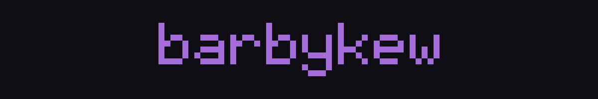

<!--
  Palette matches Shulker's own GlassUIConstants:
    accent   #A36CD8   (163,108,216)
    surface  #0F0E14   (15,14,20)
    text     #C5C9D8   (197,201,216)
-->

  

  
  
  

 

## `~/ stack`

  

 

## `~/ me`

I write low-level Java and front-end TypeScript, and I'd rather build a thing myself than
pull in a dependency for it — which is why my client ships its own renderer instead of
borrowing one.

## `~/ shulker`

The project I spend most of my time on. A ghost client for Minecraft — though the features
aren't the hard part; keeping **one source tree honest across two Minecraft versions and two
graphics APIs at once** is.

<table>
<tr>
<td width="50%" valign="top">

**one tree, two versions**

Targets `1.21.11` and `26.2-snapshot-2` through
[Stonecutter](https://github.com/kikugie/stonecutter). Version-specific code is quarantined
in small compat classes instead of being smeared through every module — so a Minecraft
release breaks four files, not four hundred.

</td>
<td width="50%" valign="top">

**two render backends**

A custom 2D/3D renderer abstracted over **OpenGL and Vulkan**. Every shader effect ships as
a mirrored pair so neither backend is a second-class citizen.

</td>
</tr>
<tr>
<td width="50%" valign="top">

**built to be quiet**

Ghost client, so the whole design goal is that nothing it does is observable from the
outside — that constraint drives most of the interesting decisions.

</td>
<td width="50%" valign="top">

**internals**

Mixin-driven, reflective event bus, and a settings system that builds its own GUI from
module fields. ~100 modules across combat, movement, render, player and HUD.

</td>
</tr>
</table>

 

## `~/ stats`

  
  

  

  

 

## `~/ contributions`

<picture>
  <source media="(prefers-color-scheme: dark)" srcset="https://raw.githubusercontent.com/barbykew/barbykew/output/snake-dark.svg">
  <source media="(prefers-color-scheme: light)" srcset="https://raw.githubusercontent.com/barbykew/barbykew/output/snake.svg">
  
</picture>

  

 

